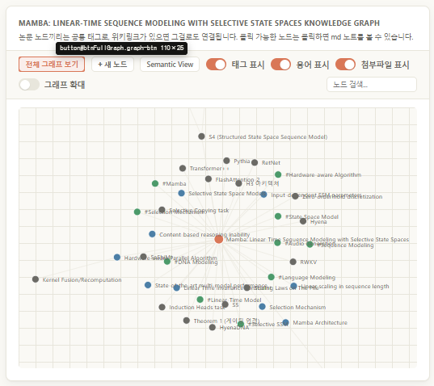

# Dom-Inspector

A single-file, dependency-free vanilla JS tool that lets you click any element on a page and copy a structured, DevTools-style snapshot of it (selector, DOM path, attributes, computed style, outerHTML) straight to your clipboard.

## Why this exists

When you ask an LLM to fix or restyle a specific element ("make this button bigger", "why is this div overflowing"), the model usually only has your vague description to go on — it doesn't know the element's real selector, its current computed styles, or its exact markup. That ambiguity leads to guessed selectors and fixes that target the wrong node.

`inspector.js` closes that gap: you click the element you mean, and a clean, structured text block describing exactly that element is copied to your clipboard. Paste it into the chat alongside your request ("fix **this** element: ...") and the LLM has precise, unambiguous context — real selector, real DOM position, real computed styles — instead of having to infer them from a screenshot or a natural-language description.

## How to use it

1. Add the script to your page, after your other scripts:

   ```html
   <script src="/inspector.js"></script>
   ```

   No build step, no dependencies — it's a single self-contained IIFE.

2. Toggle inspect mode on/off either by:
   - Clicking the small circular button that appears in the bottom-right corner of the page, or
   - Pressing **Alt+Shift+C** anywhere on the page.

3. While inspect mode is active, hover over the page — the element under your cursor is highlighted with an outline and a floating label showing its tag, id, classes, and size.

4. Click the element you want. The click is intercepted (it won't trigger the element's normal behavior), and a structured snapshot of that element is copied to your clipboard automatically. A small toast confirms the copy, and the snapshot is also added to a floating panel of recent captures (last 8), each of which can be re-copied with one click.

5. Press **Escape** at any time to exit inspect mode.

## Example

While inspect mode is active, hovering over an element outlines it and shows a floating label with its tag, id, and size:



Clicking that button:

```html
<button class="graph-btn" id="btnFullGraph">전체 그래프 보기</button>
```

copies something like this to your clipboard:

```
🔍 Inspected Element
Tag: <button id="btnFullGraph">
Selector: #btnFullGraph
DOM Path: button#btnFullGraph
Classes: graph-btn
Attributes: class="graph-btn", id="btnFullGraph"
Text: "전체 그래프 보기"
Rect: 110×25 at (1461, 164)
Computed Style:
  display: block
  position: static
  top: auto
  right: auto
  bottom: auto
  left: auto
  width: 109.708px
  height: 25.3333px
  margin: 0px
  padding: 4px 10px
  flex-direction: row
  justify-content: normal
  align-items: normal
  gap: normal
  grid-template-columns: none
  grid-template-rows: none
  color: rgb(217, 119, 87)
  background-color: rgb(255, 255, 255)
  border: 1.33333px solid rgb(217, 119, 87)
  border-radius: 6px
  font-size: 11.52px
  font-weight: 600
  line-height: normal
  letter-spacing: normal
  box-shadow: none
  opacity: 1
  z-index: auto
  overflow: visible
  cursor: pointer
  transition: border-color 0.15s, color 0.15s, background 0.15s
Outer HTML:
<button class="graph-btn" id="btnFullGraph">전체 그래프 보기</button>
```

That block is enough for an LLM to know exactly which element you mean, what it currently looks like, and where it sits in the page — no back-and-forth needed.
